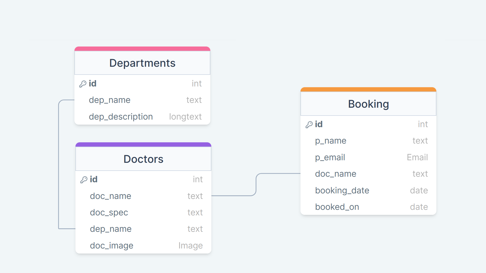

<!-- 

  

 -->
<h1 align="center">Django Hospital Appointment</h1>

 A hospital appointment web app built using Django as backend. I developrd this project along with a youtube tutorial. This project is done for learning basics of django and CRUD operations. We can take appointment with available doctors and get a confirmation. When user take an appointment, the details will go to the django inbuilt admin page

# 🧱 Database Structure 

In this project there are mainly 3 database tables (Departments, Doctors, Booking)

# ⛏️ Built With 

- [Sqlite](https://www.mongodb.com/) - Database
- [Django](https://expressjs.com/) - Web Backend Framework
- [Bootsrap](https://vuejs.org/) - Front-End

<!-- ## ✍️ Authors 

- [@kylelobo](https://github.com/kylelobo) - Idea & Initial work

See also the list of [contributors](https://github.com/kylelobo/The-Documentation-Compendium/contributors)
who participated in this project. -->

## 📷 Screenshots

# 🎉 Acknowledgments 

- Tutorial followed : YesTech Media YouTube Channel
- Link : 
