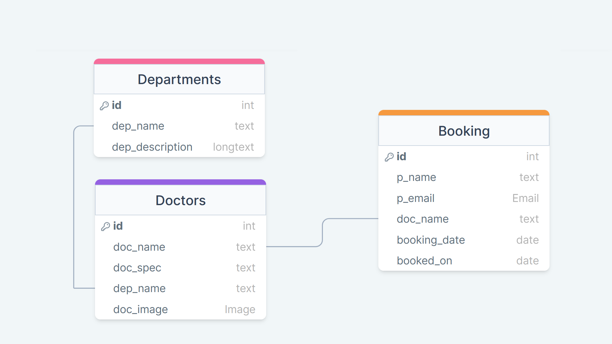

<!-- 

  

 -->
<h1 align="center">Django Hospital Appointment</h1>

 A hospital appointment web app built using Django as backend. I developrd this project along with a youtube tutorial. This project is done for learning basics of django and CRUD operations. We can take appointment with available doctors and get a confirmation. When user take an appointment, the details will go to the django inbuilt admin page

# 🧱 Database Structure 

In this project there are mainly 3 database tables (Departments, Doctors, Booking)

# ⛏️ Built With 

- [Sqlite](https://www.bing.com/ck/a?!&&p=e5936707483090e9JmltdHM9MTY2OTA3NTIwMCZpZ3VpZD0wY2NkN2NjYS0yZGE2LTY3OTYtMTY3OC02ZWU1MmNjMzY2ZjAmaW5zaWQ9NTE4Nw&ptn=3&hsh=3&fclid=0ccd7cca-2da6-6796-1678-6ee52cc366f0&psq=sqlite&u=a1aHR0cHM6Ly93d3cuc3FsaXRlLm9yZy9pbmRleC5odG1s&ntb=1)) - Database
- [Django](https://www.bing.com/ck/a?!&&p=c2e9da1d85225d17JmltdHM9MTY2OTA3NTIwMCZpZ3VpZD0wY2NkN2NjYS0yZGE2LTY3OTYtMTY3OC02ZWU1MmNjMzY2ZjAmaW5zaWQ9NTE5MQ&ptn=3&hsh=3&fclid=0ccd7cca-2da6-6796-1678-6ee52cc366f0&psq=django&u=a1aHR0cDovL3d3dy5kamFuZ29wcm9qZWN0LmNvbS8&ntb=1) - Web Backend Framework
- [Bootsrap](https://www.bing.com/ck/a?!&&p=910dcdb504cea950JmltdHM9MTY2OTA3NTIwMCZpZ3VpZD0wY2NkN2NjYS0yZGE2LTY3OTYtMTY3OC02ZWU1MmNjMzY2ZjAmaW5zaWQ9NTIwNg&ptn=3&hsh=3&fclid=0ccd7cca-2da6-6796-1678-6ee52cc366f0&psq=bootstrap&u=a1aHR0cHM6Ly9nZXRib290c3RyYXAuY29tLw&ntb=1) - Front-End

<!-- ## ✍️ Authors 

- [@kylelobo](https://github.com/kylelobo) - Idea & Initial work

See also the list of [contributors](https://github.com/kylelobo/The-Documentation-Compendium/contributors)
who participated in this project. -->

## 📷 Screenshots

# 🎉 Acknowledgments 

- Tutorial followed : YesTech Media YouTube Channel
- Link : 
